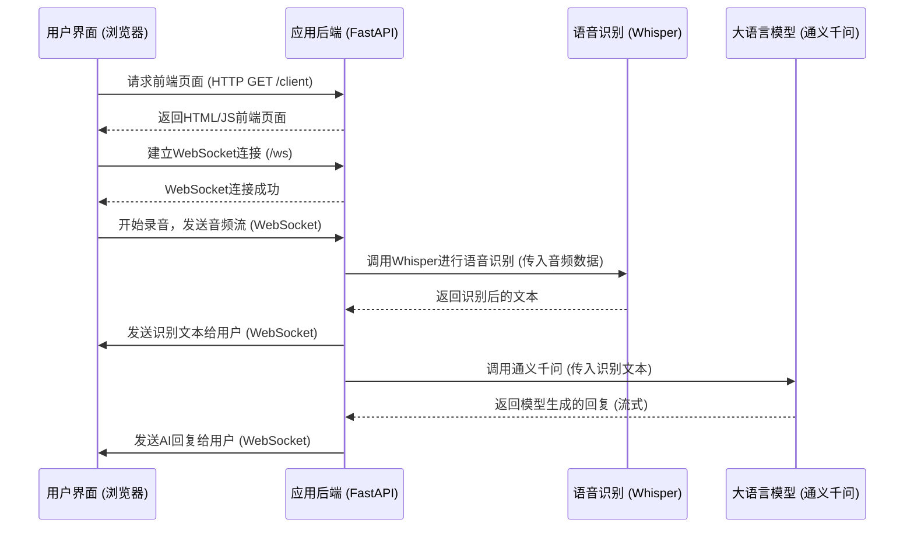

## 1. 引言

本项目是一款基于 FastAPI 框架开发的智能语音助手应用。其核心功能包括通过 WebSocket 实现的实时语音识别，以及与阿里云通义千问大语言模型的交互对话。在技术实现上，应用采用 OpenAI 的 Whisper 模型完成语音到文本的转换，并借助兼容 OpenAI 的 API 接口来调用通义千问大模型，从而生成智能回复。

## 2. 系统架构

本语音助手应用的系统架构主要由以下几个核心组件构成：用户界面（浏览器）、应用后端（FastAPI）、实时通信（WebSocket）、语音识别模块（Whisper）以及大语言模型（通义千问）。

**组件说明：**

*   **用户界面 (浏览器端)**：用户通过浏览器访问前端页面，进行语音输入、控制录音开始/停止，并实时查看识别结果和AI回复。
*   **应用后端 (FastAPI 服务器)**：基于 FastAPI 构建，负责处理 HTTP 请求（如提供前端页面）、管理 WebSocket 连接、接收音频流、调用语音识别服务以及与大语言模型进行交互。
*   **实时通信 (WebSocket)**：浏览器与 FastAPI 服务器之间通过 WebSocket 建立全双工通信连接，用于实时传输音频数据和双向消息（用户语音转文字结果、AI 模型回复）。
*   **语音识别 (Whisper)**：后端服务器接收到音频数据后，调用 OpenAI Whisper 模型将其转换为文本格式。
*   **大语言模型 (通义千问)**：后端服务器将识别后的文本作为提示（prompt）发送给阿里云通义千问大语言模型，获取智能回复。

**交互流程示意图：**



## 3. 模块说明

本应用的系统功能主要通过前端和后端两大模块协作完成。

### 3.1 前端模块 (HTML/JavaScript)

前端模块负责提供用户交互界面，主要功能包括：

*   **用户界面 (UI)**：
    *   提供简洁的网页，包含“开始录音”和“停止录音”按钮。
    *   设有专门区域显示语音识别结果、用户提问以及AI的回答。
    *   包含音频电平可视化，以指示麦克风输入状态。
*   **语音录制与处理**:
    *   使用 `navigator.mediaDevices.getUserMedia` API 获取用户麦克风的音频输入权限，配置为16kHz采样率的单声道音频。
    *   利用 `MediaRecorder` API 进行音频录制，音频格式为 `audio/webm;codecs=opus`。
    *   录制的音频数据会分块（每6秒或手动停止时）通过 WebSocket 发送至后端。
*   **WebSocket 客户端**:
    *   与后端服务器建立和维护 WebSocket (`ws://<host>/ws`) 连接。
    *   负责将录制好的音频数据块（`ArrayBuffer`格式）发送到服务器。
    *   接收服务器推送的各类消息，包括：
        *   用户本人语音的转写文本。
        *   AI 模型的回复文本。
        *   系统状态/错误信息。
    *   将接收到的消息动态更新到用户界面，区分用户和AI助手的消息样式。
    *   实现简单的断线重连机制和心跳包（Ping/Pong）以维持连接活跃。
*   **状态展示**:
    *   在等待后端处理时，显示“正在处理”等提示信息。

### 3.2 后端模块 (FastAPI - `main.py`)

后端模块基于 FastAPI 框架构建，负责处理核心业务逻辑。

*   **HTTP 服务 (`/client`)**:
    *   路径：`GET /client`
    *   功能：提供前端应用的 HTML 页面及内嵌的 JavaScript 和 CSS。
*   **WebSocket 服务 (`/ws`)**:
    *   路径：`WebSocket /ws`
    *   功能：
        *   处理来自客户端的 WebSocket 连接请求。
        *   接收客户端发送的音频数据流（二进制数据）和控制消息（如心跳包 "ping"）。
        *   对 "ping" 消息回复 "pong" 以维持连接。
        *   将接收到的音频数据交由异步任务 `process_and_send_result` 进行处理，避免阻塞主通信链路。
*   **语音处理模块 (`process_audio_with_whisper` function)**:
    *   输入：从 WebSocket 接收到的原始音频数据（bytes）。
    *   处理流程：
        1.  将接收到的音频数据保存为一个临时的 `.webm` 文件。
        2.  调用 OpenAI Whisper 模型 (默认为 "tiny" 版本，语言指定为中文 "zh") 对该音频文件进行转写。此过程在线程池中执行，以避免阻塞 asyncio 事件循环。
        3.  转写完成后，删除临时音频文件。
    *   输出：识别出的文本字符串。若识别失败或结果为空，则返回空字符串或提示信息。
    *   日志：记录音频接收、临时文件路径、识别结果及可能发生的错误。
*   **大语言模型交互模块 (`call_tongyi_model` function)**:
    *   输入：经过 Whisper 识别后的用户文本（prompt）。
    *   处理流程：
        1.  使用配置好的 OpenAI SDK 客户端（已指向阿里云通义千问的兼容接口）发起请求。
        2.  请求参数中指定模型名称 (如 `qwen3-235b-a22b`) 并启用流式传输 (`stream=True`)。
        3.  异步接收模型返回的流式响应数据块。
        4.  将数据块累积拼接成完整的回复文本。
    *   输出：通义千问大模型生成的完整回复文本。
    *   错误处理：捕获 API 调用过程中的异常（如网络错误、API密钥问题、请求参数错误），并记录详细错误日志，返回预设的错误提示信息。
    *   日志：记录API调用时间、输入prompt、模型回复、Token使用量（估算）等信息。
*   **结果整合与推送 (`process_and_send_result` function)**:
    *   协调语音识别和LLM调用。
    *   将 Whisper 的识别结果（作为用户消息）通过 WebSocket 发送给客户端。
    *   将通义千问的回复（作为助手消息）通过 WebSocket 发送给客户端。
    *   如果语音识别结果为空，则直接向客户端发送提示信息，不调用LLM。
*   **配置与日志**:
    *   通过 `.env` 文件加载环境变量（如 `TONGYI_API_KEY`, `TONGYI_API_BASE`）。
    *   全面的日志记录，包括应用运行状态、API交互详情、错误信息等，输出到控制台和 `app.log` 文件。

## 4. 数据流程说明

用户与语音助手的一次完整交互涉及以下数据流转步骤：

1.  **用户授权与录音开始**:
    *   用户在浏览器前端界面点击“开始录音”按钮。
    *   浏览器请求麦克风使用权限；用户授权后，前端 JavaScript 开始通过 `MediaRecorder` API 捕获音频。音频流以 `audio/webm;codecs=opus` 格式进行编码。
    *   同时，前端与后端 FastAPI 服务器建立 WebSocket 连接。

2.  **音频数据分块传输**:
    *   前端 `MediaRecorder` 将录制的音频按固定时间间隔（例如6秒）或在用户点击“停止录音”时，切割成数据块 (Blob)。
    *   每个音频数据块通过已建立的 WebSocket 连接，以二进制 (`ArrayBuffer`) 形式发送至后端 `/ws` 端点。

3.  **后端接收与初步处理**:
    *   FastAPI 后端 WebSocket 服务接收到二进制音频数据。
    *   为避免阻塞 WebSocket 通信，后端为每个接收到的音频块创建一个异步任务 (`process_and_send_result`) 进行后续处理。

4.  **语音识别 (Audio-to-Text)**:
    *   在 `process_audio_with_whisper` 函数内，接收到的音频数据被写入一个临时 `.webm` 文件。
    *   调用 Whisper 模型（在独立的线程中运行）对该音频文件进行语音转文字处理，指定语言为中文。
    *   获得转写后的文本结果。临时文件被删除。

5.  **用户输入文本反馈**:
    *   后端通过 WebSocket 将 Whisper 识别出的文本内容（作为用户消息）发送回前端。
    *   前端界面接收到此消息后，将其展示在对话区域，用户可以看到自己说话内容的文字版。

6.  **大语言模型调用**:
    *   如果语音识别结果非空，后端 `call_tongyi_model` 函数会将此文本作为提示 (prompt) 内容。
    *   通过 OpenAI SDK（配置指向通义千问服务地址和 API Key）向通义千问大语言模型发起请求，请求采用流式（`stream=True`）方式。

7.  **AI 回复流式接收与处理**:
    *   后端接收来自通义千问的流式响应。数据以小块 (chunks) 形式陆续返回。
    *   后端将这些小块内容拼接起来，形成完整的 AI 回复文本。

8.  **AI 回复文本反馈**:
    *   后端通过 WebSocket 将通义千问生成的完整回复文本（作为AI助手消息）发送回前端。
    *   前端界面接收到此消息后，将其展示在对话区域。

9.  **录音与交互持续**:
    *   如果用户未点击“停止录音”，前端会继续录制音频并重复步骤 2-8，实现连续对话。
    *   用户点击“停止录音”后，前端停止发送音频，等待当前所有在处理的语音片段完成识别和回复。

10. **连接维持与关闭**:
    *   在整个会话期间，WebSocket 连接通过心跳机制（ping/pong）保持活跃。
    *   当用户关闭页面或发生连接错误时，WebSocket 连接关闭。

## 5. 关键技术栈

本项目的实现依赖于以下关键技术：

*   **后端框架**: FastAPI (基于 Python 3.10+)
*   **语音识别**: OpenAI Whisper 模型 (本项目默认使用 "tiny" 版本)
*   **大语言模型**: 阿里云通义千问 (通过其 OpenAI 兼容 API 接口进行调用)
*   **前端技术**: HTML5, JavaScript (ECMAScript 6+), WebRTC API (用于麦克风访问和音频捕获)
*   **实时通信**: WebSocket (由 FastAPI 支持，用于客户端与服务器间的双向数据流)
*   **依赖管理**: Pip (Python 包安装器)
*   **环境变量管理**: `python-dotenv` 库

## 6. 部署与运行说明

### 6.1 环境要求

*   **Python 版本**: 3.10 或更高。
*   **操作系统**: 可运行 Python 的常见操作系统（Windows, macOS, Linux）。
*   **浏览器**: 支持 WebRTC API 的现代浏览器（如 Chrome, Firefox, Edge, Safari 最新版本）。
*   **网络**: 稳定的互联网连接，用于下载模型、依赖以及访问云端大语言模型服务。

### 6.2 安装步骤

1.  **克隆或下载项目代码** (如果适用，通常设计文档不包含此步骤，但可提及源码获取方式)
2.  **安装 Python 依赖**:
    打开命令行终端，进入项目根目录，执行以下命令：
    ```bash
    pip install fastapi uvicorn openai python-dotenv whisper
    ```
3.  **配置环境变量**:
    在项目根目录下创建一个名为 `.env` 的文本文件。文件内容如下，请将占位符替换为您的实际凭证：
    ```env
    TONGYI_API_KEY="您的通义千问API密钥"
    TONGYI_API_BASE="https://dashscope.aliyuncs.com/compatible-mode/v1"
    ```
    *   `TONGYI_API_KEY`: 您在阿里云平台申请的通义千问服务 API 密钥。
    *   `TONGYI_API_BASE`: 通义千问服务 OpenAI 兼容模式的 API 端点。通常默认为 `https://dashscope.aliyuncs.com/compatible-mode/v1`，如有变更请参考官方文档。

### 6.3 运行应用

1.  **启动后端服务器**:
    在项目根目录的命令行终端中，执行以下命令：
    ```bash
    python main.py
    ```
    服务器启动后，默认监听 `127.0.0.1` 地址的 `8000` 端口。您将在终端看到类似 `Uvicorn running on http://127.0.0.1:8000 (Press CTRL+C to quit)` 的输出。

2.  **访问前端应用**:
    打开您的现代网页浏览器，访问以下地址：
    ```
    http://127.0.0.1:8000/client
    ```
    即可加载语音助手的前端界面，开始进行语音交互。

## 7. 未来展望与可改进点

本项目目前已实现核心的语音助手功能，未来可以从以下几个方向进行扩展和优化：

*   **模型选择与优化**:
    *   **Whisper 模型替换**: 考虑允许用户根据网络情况和对识别准确率的要求，动态选择不同大小的 Whisper 模型（如 base, small, medium），或者集成其他更轻量级或针对特定场景优化的语音识别引擎。
    *   **LLM 更换/多模型支持**: 增加对其他大语言模型的支持，允许用户配置或动态选择，例如 OpenAI 的 GPT 系列或其他开源/商业模型。
*   **用户体验增强**:
    *   **更丰富的交互方式**: 支持文本输入、历史对话编辑、多轮对话上下文管理优化等。
    *   **个性化设置**: 如语音合成（TTS）的音色选择、语速调整等。
    *   **移动端适配**: 优化前端界面在移动设备上的显示和操作体验。
*   **功能扩展**:
    *   **自定义唤醒词**: 实现通过特定唤醒词启动语音识别，而非完全依赖按钮。
    *   **技能插件系统**: 引入插件化思想，方便扩展特定领域功能，如查询天气、播放音乐、智能家居控制等。
    *   **用户账户与数据持久化**: 支持用户登录，保存对话历史和偏好设置。
*   **性能与健壮性**:
    *   **错误处理与容错**: 进一步细化各类异常（网络、API、音频设备等）的处理和用户提示。
    *   **安全性增强**: 对 API 密钥等敏感信息进行更安全的管理（如使用专门的密钥管理服务）；考虑对 WebSocket 通信增加认证。
    *   **可伸缩性**: 针对高并发场景，对后端服务进行优化，考虑如负载均衡、异步任务队列的持久化等方案。
*   **部署优化**:
    *   **容器化部署**: 提供 Dockerfile，方便使用 Docker 或 Kubernetes 进行容器化部署。
    *   **云平台集成**: 提供部署到常见云平台（如阿里云、AWS、Azure）的指南。
